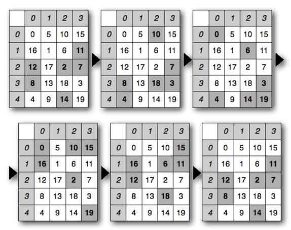
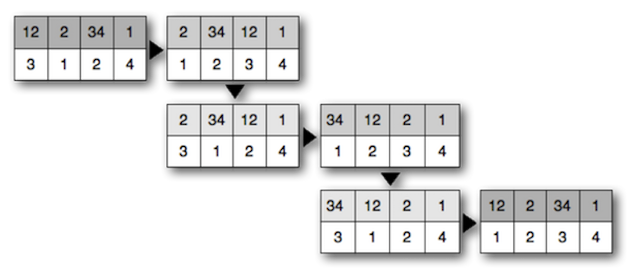
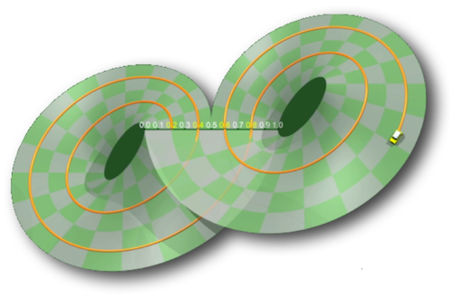

# cl-cycle

Cycle generator

This library generates cycle from a numeric sequence especially for the musical purpose, like some composers have used in their respective compositions (see Olivier Messiaen with its symmetrical permutations, also Gérard Grisey or Jean Barraqué, and Iannis Xenakis for its _cribles rythmiques_).
This library extends this principle with mathematical algorithms, simply to explore this research field in a musical context.

> Briefly, this is some prospecting tools that fit in a heuristic perspective, intended to serve as a musical discourse, according to the theme of _cyclicity_.
Thus, it is possible to consider the construction of musical representations of mathematical ideas, recognizing that musical experience can not be reduced to a symbolic system.
In other words, it must be possible to report an association between network composition, performance and listening ...

The result of each algorithm is a list including the cycle itself prepended by its _path_ if it exists.

## Algorithms

- - - -

`[ KAPREKAR-CONSTANT ]`

The Kaprekar's algorithm consists to associate any number __x__ to another number __K(x)__ generated as follow:

- According to the digits of __x__ in radix __n__, one forms the number __x1__ by ranking in increasing order these digits and the number __x2__ by ranking in decreasing order.

- Then __K(x) = x2 - x1__.

The process is iterated until a cyclic redundancy.

- - - -

`[ RHYTHMIC-SIEVE ]`

Kind of _Metabole_ according to Iannis Xenakis, rhythmic sieve rely on the construction of a matrix to generate two cycles: one by horizontal shift __(i)__ and one by vertical shift __(j)__.

This example illustrates the process of permutation by a vertical shift of the sieve in the matrix.

- - - -

`[ PEA-PATTERN ]`

Primarily developed by John Conway, the pea pattern is a variation of a _look-and-say_ sequence by counting the elements of a seed from the lowest number to the highest iteratively until the effectiveness of a cycle.

- - - -

`[ SYMMETRIC-GROUP ]`

1. Mathematical overview
>[http://math.univ-lyon1.fr/capes/IMG/pdf/cycles.pdf](http://math.univ-lyon1.fr/capes/IMG/pdf/cycles.pdf)

2. Musical application
>[http://www.entretemps.asso.fr/Nicolas/TextesNic/Barraque.html](http://www.entretemps.asso.fr/Nicolas/TextesNic/Barraque.html)

- - - -

`[ SYMMETRIC-PERMUTATION ]`

Highlighted by Olivier Messiaen, symmetric permutations constitute a system of numbered durations that consists in changing the order of its durations in order to obtain a limited number of rhythmic cells.

The order of durations (on a gray background) is switched according to the procedure of a given list (on a white background) which is re-ordered at each step.

- - - -

`[ KREUZSPIEL-PERMUTATION ]`

>[https://digital.lib.washington.edu/researchworks/handle/1773/23571](https://digital.lib.washington.edu/researchworks/handle/1773/23571)

In 1951, Karlheinz Stockhausen wrotes _Kreuzspiel_ (***Jeux croisés***) which uses the crossing technique inspired by Olivier Messiaen called ***des extrêmes au centre*** as a kind of ***retrogradation en éventail***. This consists to take the first and the last values of a sequence and places them in the middle (or optionally at a given indexed place) by opposite crossing.

- - - -

`[ CIRCULAR-PERMUTATION ]`

This algorithm consists of moving the first element of a list to the tail of this list. This is done __n__ times with __n__ equal to the length of the list, whose relevance in the context of this library is to perform a circular permutation cycle from a given radix to another.

- - - -

`[ LORENZ-DISCRETISATION ]`

>[https://www.chaos-math.org/en/chaos-vii-strange-attractors.html](https://www.chaos-math.org/en/chaos-vii-strange-attractors.html)

In 1970, Birman, Guckenheimer, and Williams propose a model of dynamic discretization of Lorenz attractors, characterized by the periodicity of the orbits by a return to a point already crossed –– i.e. a cycle.

Let __i__ be an element in the interval __[0, 1]__ and __I__ the set of points ordered in time calculated from __i__ to __t0__, each point at __t+1__ is calculated as follows:

- __i(t+1) = 2i(t) if i(t) < 1__;
- __i(t+1) = 2i(t)-1 if i(t) > 1__;

until __i(tn+1)__ is element of __I__.

Model of Birman, Guckenheimer and Williams. Initially __i=0.2__.

- - - -

`[ COLLATZ-CONJECTURE ]`

In 1928, Lothar Collatz invented a sequence built from a positive integer according to the following rules:

- if __x(n)__ is even, then __x(n+1)__ is equal to __x(n)__ divided by __2__;
- if __x(n)__ is odd, then __x(n+1)__ is equal to __1__ plus __x(n)__ multiplied by __3__.

The series thus constructed always ends –– until the contrary is proved –– by a trivial cycle __(4 2 1)__ for positive integers. This hypothesis is called Syracuse conjecture.

- - - -

`[ INTERLACE-CYCLE ]`

Based on the principle of ornamental interlace, each pattern is repeated some times according to the least common multiple to generate a complete cycle.

The result is a list where each element groups the circular permutations of each pattern, i.e. the number of voices equal to the number of patterns.

- - - -

`[ EUCLIDEAN-RHYTHM ]`

>[http://cgm.cs.mcgill.ca/~godfried/publications/banff.pdf](http://cgm.cs.mcgill.ca/~godfried/publications/banff.pdf)

Application of Bjorklund's algorithm of uniformly distributing some rhythmic impacts in a given interval of rhythmic units –– according to Euclid's algorithm determining the greatest common divisor (GCD) [Book VII of the Elements of Euclid].
