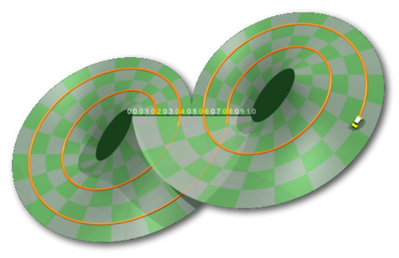

# cl-cycle

Cycle generator

This library generates cycle from a numeric sequence especially for musical purpose, like some composers have used in their respective compositions (see Olivier Messiaen with its symmetricals
permutations, also Gérard Grisey or Jean Barraqué, and Iannis Xenakis for its « cribles rythmiques »). 
This library extend this principle with mathematical algorithms, simply to explore this research field in a musical context.

> Briefly, this is some prospecting tools that fit in a heuristic perspective, intended to serve as a musical discourse, according to the theme of « cyclicity ».
Thus, it is possible to consider construction of musical representations of mathematical ideas, recognizing that musical experience can not be reduced to a symbolic system. 
In other words, it must be possible to report an association between network composition, performance and listening ... 

## Algorithmes

- - - -

**Kaprekar**

`[ KAPREKAR-CONSTANT ]`

L'algorithme de Kaprekar consiste à associer à un nombre quelconque x un autre nombre K(x) généré de la façon suivante :

- On considère les chiffres de x, écrits en base n. On forme le nombre x1 en arrangeant ces chiffres dans l'ordre croissant et le nombre x2 en les arrangeant dans l'ordre décroissant.
- On pose K(x) = x2 - x1.

 On itère ensuite le processus jusqu'à obtenir une redondance cyclique.

- - - -

**Cribles Rythmiques**

`[ RHYTHMIC-SIEVE ]`

Forme de métabole selon Iannis Xenakis, les cribles rythmiques reposent sur la construction d'une matrice afin de générer deux cycles: l'un par décalage horizontal (i), l'autre vertical (j).

Cet exemple illustre le processus de permutation par un décalage vertical du crible dans la matrice.

- - - -

**Commentaires Cycliques**

`[ PEA-PATTERN ]`

Issue de suites autoréférentes décrites par l'allemand M. Hilgemeir, puis développer par John Conway notamment pour les suites de commentaires numériques infinis, les commentaires cycliques consistent à dénombrer les éléments d'une graine qui seront triés de façon croissante à chaque itération jusqu'à l'effectivité d'un cycle.

- - - -

**Permutations Cycliques**

`[ SYMMETRIC-GROUP ]`

1. Aperçu mathématiques
>[http://math.univ-lyon1.fr/capes/IMG/pdf/cycles.pdf](http://math.univ-lyon1.fr/capes/IMG/pdf/cycles.pdf)

2. Application musicale
>[http://www.entretemps.asso.fr/Nicolas/TextesNic/Barraque.html](http://www.entretemps.asso.fr/Nicolas/TextesNic/Barraque.html)

- - - -

**Permutations Symétriques**

`[ SYMMETRIC-PERMUTATION ]`

Mise en évidence par Olivier Messiaen, les permutations symétriques constituent un système de durées numérotées qui consiste à changer l'ordre de ses durées afin d'obtenir un nombre limité de cellules rythmiques.

L'ordre des durées (sur fond gris) permute suivant la procédure d'une liste donnée (sur fond blanc) qui est ré-ordonnée à chaque étape.

- - - -

**Permutations Circulaires**

`[ CIRCULAR-PERMUTATION ]`

Cet algorithme consiste à permuter une liste élément par élément dont la pertinence dans le cadre de cette librairie est d'effectuer un cycle par permutation circulaire d'une base donnée à une autre.

- - - -

**Cycle de Lorenz**

`[ LORENZ-DISCRETISATION ]`

>[http://www.chaos-math.org/fr/chaos-vii-attracteurs-étranges](http://www.chaos-math.org/fr/chaos-vii-attracteurs-étranges)

En 1970, Birman, Guckenheimer et Williams proposent un modèle de discrétisation dynamique des attracteurs de Lorenz qui se caractérise par une cyclicité de la périodicité des orbites par un retour à un point déjà franchi.
Soit i un élément compris dans l'intervalle [0, 1] et I l'ensemble des points ordonnés dans le temps calculés à partir de i à t0, chaque point à t+1 est calculé de la façon suivante:

- i(t+1) = 2i(t) si i(t) est inférieur à 1;
- i(t+1) = 2i(t)-1 si i(t) est supérieur à 1;

jusqu'à ce que i(tn+1) soit élément de I.

Modèle de Birman, Guckenheimer et Williams. Au départ i=0.2.

- - - -

**Suite de Syracuse**

`[ COLLATZ-CONJECTURE ]`

En 1928, Lothar Collatz inventa une suite construite à partir d'un entier positif selon les règles suivantes:

- si x(n) est pair, alors x(n+1) est égal à x(n) divisé par 2;
- si x(n) est impair, alors x(n+1) est égal à 1 plus x(n) multiplié par 3.

La série ainsi construite finit toujours - jusqu'à preuve du contraire - par un cycle, dit trivial (4 2 1) pour les entiers positifs. Cette hypothèse est appelée conjecture de Syracuse.

- - - -

**Cycle d'entrelacs**

`[ INTERLACE-CYCLE ]`

Reposant sur le principe des entrelacs d'ornementation, chaque motif est répété un certain nombre de fois selon le plus petit commun multiple afin de générer un cycle complet.
Le résultat est une liste où chaque élément regroupe les permutations circulaires de chaque motif, soit un nombre de voix égal au nombre de motifs.